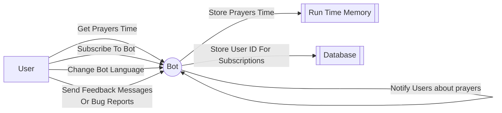

# gopray 🙏

A Telegram Bot to get muslim prayers time, And subscribe to get notified on the prayers time

## Contributing 🤼

Before we start talking about the bot, I would really appreciate if you can contribute to this project by adding more features or fixing bugs. It is totally open source and free to use. 😁

## Usecase 🛠️

## Subscription Feature 📢

This feature allows the bot to notify users `20 min` before the prayers time. (Time is set by the `UPCOMING_REMINDER` env variable)

Users can subscribe to the bot by sending `/subscribe` command to the bot. And unsubscribe by sending `/unsubscribe` command to the bot.

Also on friday the bot will remind the user to pray Gomaa prayer. at `7:00 PM` (Time is set by the `GOMOAA_REMINDER_HOUR` env variable), This is value to when to remind them, The prayer time is calculated based on the prayers time of the day and sent to the user.

### How it works 🤔

In order to implement this feature, We have to make to bot wait until `20 min` are left before the prayer's time. And then send a notification to the subscribed users.

Also, when the time of the prayer's arrive we should also notify them.

So for that I use simple `channels` to sleep the goroutine until the time is right to send the notification.

The first sleep is until the `20 min` before the prayer's time. And the second is until the prayer's time.

for more details check the [notifier code](./telegram/internal/adapters/notifier/notifier.go).

## Bot Options 🤖

### Default Commands 📝

| Command      | Description                                         |
|--------------|-----------------------------------------------------|
| /help        | Get help message showing all possible commands      |
| /prayers     | Get prayers time                                    |
| /date        | Get prayers time by date                            |
| /subscribe   | Subscribe to get notified on the prayers time       |
| /unsubscribe | Unsubscribe to not get notified on the prayers time |
| /lang        | Change the bot language (Default English)           |
| /feedback    | Send feedback to the bot owner                      |
| /bug         | Report a bug to the bot owner                       |

### Admin Commands 📝

| Command  | Description                        |
|----------|------------------------------------|
| /subs    | Get subscribers count              |
| /sall    | Send message to all subscribers    |
| /respond | Respond to feedback or bug message |

## References 📚

- [Telegram API (Telego)](https://github.com/SakoDroid/telego)
- [Prayer Times Site](http://dumrt.ru/ru/help-info/prayertime/)

## Upcoming Features 🚀

### Version 1 Milestones 🏁
- [x] Support date format for `/prayersdate` command with leading zeros and with delimiters (. / -)
- [x] Implement subscriptions & notifications
- [x] Update text messages to be more user-friendly

### Version 2 Milestones 🏁
- [x] store prayers time in memory to reduce the number of requests to the database since the prayers time is not changing
- [x] make response endpoint for admin to respond to feedback & bug messages
- [x] remind about gomaa prayer on friday

### Version 3 Milestones 🏁
- [x] Add time keyboard to `/date` command
- [x] Remove selection message for `/date` & `/lang` after the use interacts with the message or timeout
- [x] On new user commands terminate other going channels that are listening to the chat
- [x] Add feature to delete old prayer time message when new one is sent
- [x] Add feature to send all subscribers a message from admin
- [x] Add feature to get count of subscribers for admin
- [x] Write more robust tests for core features

### Version 4 Milestones 🏁
- [x] Add different languages support (AR, RU, TT, TR, UZ)
- [x] Use script messages in the bot
- [x] Set user script before command if nor set
- [x] USe script commands in notifications
- [x] Fix prayers timetable for other languages
