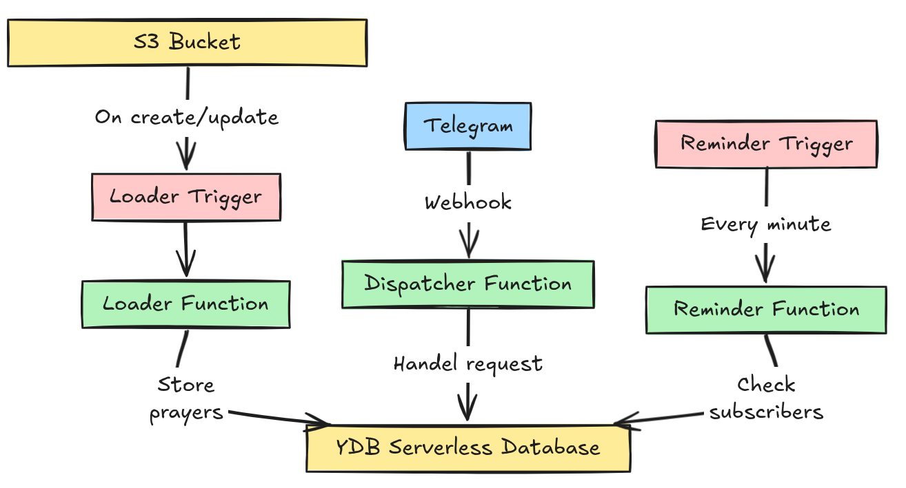
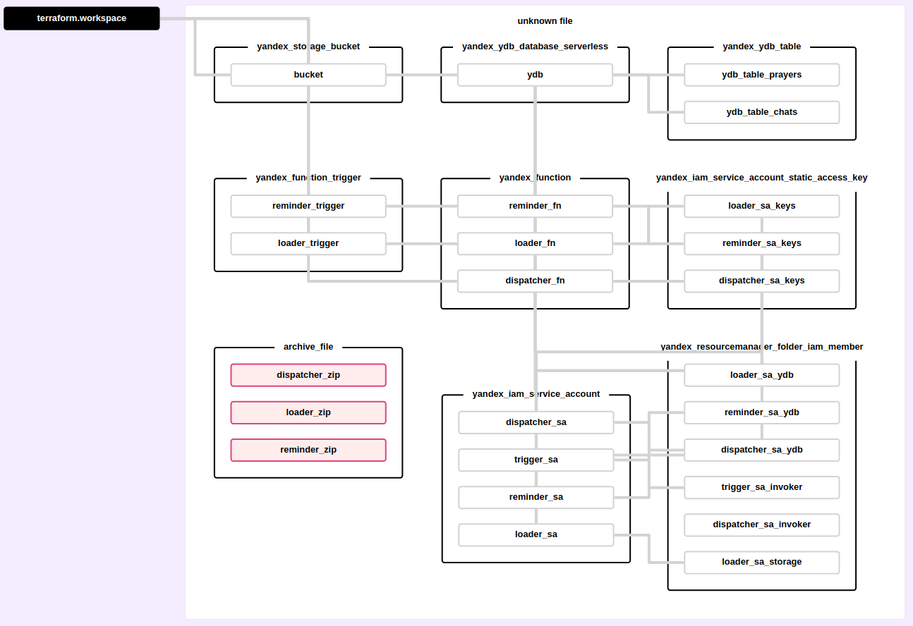

# prayer-bot 🙏

A serverless Telegram bot that provides Muslim prayer times and sends notifications when prayers are approaching.

[](https://wakatime.com/badge/user/965e81db-2a88-4564-b236-537c4a901130/project/635dffc4-6a06-4e43-9a87-5bb977437cdb)
[](https://goreportcard.com/report/github.com/escalopa/gopray)

## Currently Available Cities

| City      | Bot                                                        |
|-----------|------------------------------------------------------------|
| Kazan     | [@kazan_prayer_bot](https://t.me/kazan_prayer_bot)         |
| Innopolis | [@innopolis_prayer_bot](https://t.me/innopolis_prayer_bot) |

---

## Architecture 🏗️

This bot is completely serverless, utilizing Yandex Cloud Functions for operation and YDB for data storage.





For infrastructure configuration details, check the [terraform file](./main.tf).

---

## Configuration 🛠️

Bot configuration is managed through environment variables.

Below is an example of an `APP_CONFIG` value containing all bot information:

```json
{
  "648252": {
    "bot_id": 648252,          // Bot ID
    "owner_id": 1385434843,    // Bot owner ID
    "location": "Europe/Moscow", // Timezone of the city
    "token": "oa7GmLW3fncbOE0MTfV0mKxH/F37cShhxgZ1mjl614w", // Telegram token
    "secret": "Noe&uPcwjaAxjqJU_JP4C^g2V7ZDQX" // Secret key to verify requests
  },
  ...
}
```

- To find your owner ID, use [ID bot](https://t.me/myidbot)
- Bot ID is the first number before `:` in the bot token
    - TOKEN: `123456789:ABC-DEF1234ghIkl-zyx57W2v1u123ew11`
    - Bot ID: `123456789`

---

## Bot Features 🤖

### User Commands 📝

| Command     | Description                             |
|-------------|-----------------------------------------|
| today       | Get today's prayer times                |
| date        | Get prayer times for a specific date    |
| next        | Find out the next prayer time           |
| subscribe   | Subscribe to daily reminders            |
| unsubscribe | Unsubscribe from daily reminders        |
| remind      | Set reminder offset for the next prayer |
| language    | Change the bot language                 |
| help        | Show help message                       |
| bug         | Report a problem to bot owner           |
| feedback    | Send feedback to bot owner              |

### Admin Commands 📝

| Command  | Description                           |
|----------|---------------------------------------|
| admin    | Show admin help message               |
| stats    | View bot usage statistics             |
| announce | Send message to all users             |
| reply    | Reply to user's bug/feedback message  |

---

## References 📚

- [go-telegram](https://github.com/go-telegram)
- [telegram-api](https://core.telegram.org/bots/api)

---

## How to Contribute 🤝

### [1] Add a City

You do:
1. Get prayer times for a city in CSV format
2. Make a pull request (or open an issue) with the new file

I do:
1. Create a new Telegram bot
2. Upload the city file to storage bucket

### [2] Add a Language

You do:
1. Create translation text for the following files:
    - [./serverless/reminder/internal/handler/languages/text.yaml](./serverless/reminder/internal/handler/languages/text.yaml)
    - [./serverless/dispatcher/internal/handler/languages/en.yaml](./serverless/dispatcher/internal/handler/languages/en.yaml) (replace `en` with the new language code)

I do:
1. Deploy a new version of the code

### [3] Code Contributions

Found a bug? Want to add a new feature? Just open an issue or submit a pull request.

---

## Development Roadmap 🚀

### V1 ✅
- [x] Support date format for `/prayersdate` command with leading zeros and delimiters (. / -)
- [x] Implement subscriptions & notifications
- [x] Update text messages to be more user-friendly

### V2 ✅
- [x] Store prayer times in memory to reduce database requests
- [x] Add response endpoint for admin to address feedback & bug messages
- [x] Add Jumu'ah prayer reminders on Fridays

### V3 ✅
- [x] Add time keyboard to `/date` command
- [x] Remove selection message for `/date` & `/lang` after user interaction or timeout
- [x] Terminate other active channels when user sends new commands
- [x] Add feature to delete old prayer time message when a new one is sent
- [x] Enable admins to broadcast messages to all subscribers
- [x] Add feature to get subscriber count for admins
- [x] Write more robust tests for core features

### V4 ✅
- [x] Add multi-language support (AR, RU, TT, TR, UZ)
- [x] Implement script messages in the bot
- [x] Set user script before command if not set
- [x] Use script commands in notifications
- [x] Fix prayer timetables for other languages

### V5 ✅
- [x] Refactor code for better readability and maintainability
- [x] Enhance logging to be more informative
- [x] Enable using multiple bots with the same codebase

### V6 ✅
- [x] Migrate to serverless architecture
- [x] Automate deployment using Terraform
- [x] Add support for multiple cities
- [x] Add Spanish & French language support
- [x] Add `/stats` command for bot usage statistics

### V7 ✅
- [x] Add jamaat gathering feature for group chats

### V8 🔄
- [ ] Add support for all major world cities

---

## Development Setup 🖥️

Deploy bot on Yandex Cloud:

```bash
export ENV=dev # or prod
./_scripts/init.sh $ENV prayer-bot
terraform workspace select -or-create=true $ENV
terraform apply # -auto-approve
./_scripts/hook.sh
```

Generate Terraform dependencies visualization:

```bash
terraform plan -out plan.out
terraform show -json plan.out > plan.json
docker run --rm -it -p 9000:9000 -v $(pwd)/plan.json:/src/plan.json im2nguyen/rover:latest -planJSONPath=plan.json
```
