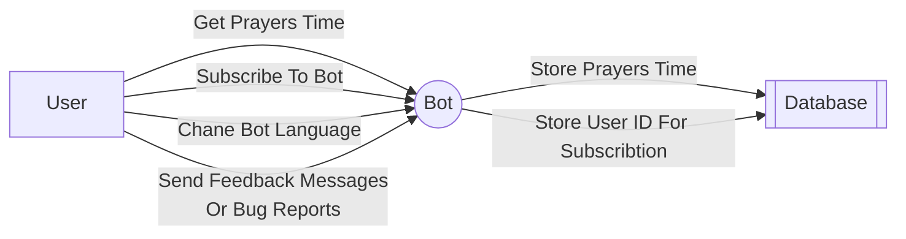

# gopray
A Telegram Bot to get muslim prayers time, And subscribe to get notified on the prayers time 

## Usecase

## Bot Options
  
| Command | Description |
| --- | --- |
| /help | Get help message showing all possible commands |
| /prayers | Get prayers time |
| /prayersdate | Get prayers time by date |
| /subscribe | Subscribe to get notified on the prayers time |
| /unsubscribe | Unsubscribe to not get notified on the prayers time |
| /lang | Change the bot language (Default English) |
| /feedback | Send feedback to the bot owner |
| /bug | Report a bug to the bot owner |

## References 

- [Telegram API (Telego)](https://github.com/SakoDroid/telego)
- [Prayer Times Site](http://dumrt.ru/ru/help-info/prayertime/)

## Upcoming Features

- [x] Support date format for prayersdate command with leading zeros and with delimiters (. / -)
- [x] Implement subscriptions & notifications
- [x] Update text messages to be more user friendly
- [ ] Add more languages support (AR, RU)
