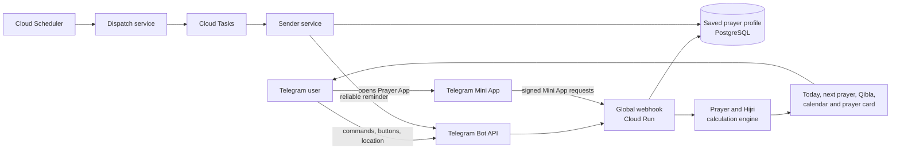
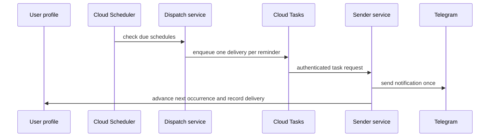

# Global prayer bot 🙏

<p align="center">
  
</p>

**Prayer times, reminders, Qibla, Hijri dates, and Islamic occasions in one
Telegram experience — for any location in the world.**

The [Global bot](global/) is this repository's primary product. It combines a
conversational Telegram bot with a Mini App, so people can use a quick command
when that is convenient or open a visual settings and tools experience when it
is not. New product work belongs in `global/`.

The original Kazan and Naples city bots are preserved in [legacy/](legacy/) for
maintenance. They are separate deployments and are not the baseline for new
features.

## How it works


```mermaid
flowchart LR
    U[Telegram user] -->|commands, buttons, location| T[Telegram Bot API]
    U -->|opens Prayer App| M[Telegram Mini App]
    T --> W[Global webhook<br/>Cloud Run]
    M -->|signed Mini App requests| W
    W --> P[(Saved prayer profile<br/>PostgreSQL)]
    W --> C[Prayer and Hijri<br/>calculation engine]
    C --> R[Today, next prayer, Qibla,<br/>calendar and prayer card]
    R --> U

    S[Cloud Scheduler] --> D[Dispatch service]
    D --> Q[Cloud Tasks]
    Q --> N[Sender service]
    N -->|reliable reminder| T
    N --> P
```

1. A person shares a location or searches for a city, then chooses their
   calculation preferences.
2. The bot calculates prayer times locally and presents them in Telegram or the
   Mini App.
3. Opt-in reminders are planned in the user's local time. Cloud Scheduler,
   Cloud Tasks, and an idempotent sender deliver them reliably even when work is
   retried.

## What makes the Global bot useful

| Feature | What the user gets | Why it matters |
| --- | --- | --- |
| Prayer times anywhere | Daily schedule, next prayer, city search, and shared Telegram location | A single bot works while travelling or moving — not only in one city. |
| Personal calculation profile | Nine calculation methods, Hanafi/Shafii Asr, high-latitude rules, and minute adjustments | Schedules can match a user's mosque, school of thought, and local convention. |
| Telegram Mini App | A visual home for schedule, settings, reminders, Places, Qibla, dates, and prayer cards | Complex choices are discoverable without memorising commands. |
| Qibla tools | Great-circle bearing and distance to the Kaaba, plus live compass where the Telegram mobile client supports it | Gives a clear direction while honestly handling device limitations. |
| Hijri dates and occasions | Corrected Umm al-Qura Hijri date, major occasions, special fasting days, and community observances | Makes the calendar useful beyond the five daily prayer times. |
| Thoughtful reminders | Prayer-time and pre-prayer reminders, fasting opportunities, Friday Al-Kahf, and occasion reminders | Notifications are opt-in, scheduled in local time, and organised by category. |
| Private rolling calendar | Revocable personal 30-day `.ics` feed for Google Calendar and other calendar apps | Users can see prayer times beside the rest of their day without sharing a public calendar. |
| Prayer cards | Localized 1080×1350 cards made in the Mini App and shared through the device or Telegram | A schedule can be saved or forwarded without server-side image storage. |
| Offline-friendly Mini App | A short-lived private on-device snapshot of saved schedules and Qibla data | The most useful information remains available during temporary connectivity issues. |
| Eight languages | English, Arabic, Spanish, French, Russian, Turkish, Uzbek, and Tatar | The UI, dates, prayer names, and reminders meet users in their language. |
| Privacy and feedback | Revocable calendar links, minimal data exposure, and private feedback/screenshot delivery | Product feedback stays practical without exposing a user's data in a group. |

### Reminder delivery at a glance


```mermaid
sequenceDiagram
    participant User as User profile
    participant Scheduler as Cloud Scheduler
    participant Dispatch as Dispatch service
    participant Tasks as Cloud Tasks
    participant Sender as Sender service
    participant Telegram as Telegram

    Scheduler->>Dispatch: check due schedules
    Dispatch->>Tasks: enqueue one delivery per reminder
    Tasks->>Sender: authenticated task request
    Sender->>Telegram: send notification once
    Sender->>User: advance next occurrence and record delivery
```

The sender uses leases and delivery keys, so a retry does not intentionally
create a duplicate notification. New prayer notifications also clean up the
previous prayer/pre-prayer message when Telegram permits deletion.

## Commands and entry points

Most Global-bot actions are also available from the persistent Telegram menu or
the **🕌 Prayer App** Mini App button. Commands remain useful for quick access,
accessibility, and group chats; profile-changing commands in groups require an
administrator.

| Global bot command | Purpose |
| --- | --- |
| `/start` | Open the welcome flow and set a location if one is missing. |
| `/location` | Share or replace the saved location. |
| `/city <name>` | Search for a location by name. |
| `/today`, `/tomorrow` | Show the local prayer schedule for that day. |
| `/next` | Show the next prayer and time remaining. |
| `/settings` | Open calculation settings and Hijri correction. |
| `/remind` | View or configure reminder preferences. |
| `/language` | Select the bot language. |
| `/feedback` | Send private feedback or a screenshot to the bot owner. |
| `/privacy`, `/help` | Read privacy information or get usage help. |
| `/method`, `/madhab`, `/highlat`, `/adjust` | Set calculation method, Asr school, high-latitude rule, or minute adjustment directly. |
| `/delete_me` | Delete the chat's stored profile data. |
| `/admin` or `/status` | Owner-only aggregate health and adoption dashboard; not shown publicly. |

### Legacy city bots

The legacy bots serve existing Kazan and Naples users. Their schedule is loaded
from city data rather than calculated from a global profile, and they remain in
maintenance mode.

| Legacy command | Purpose |
| --- | --- |
| `/start`, `/help` | Show the legacy bot menu. |
| `/today`, `/tomorrow`, `/date` | Show the city prayer schedule for today, tomorrow, or a chosen date. |
| `/next` | Show the next prayer. |
| `/remind` | Configure legacy reminder subscriptions. |
| `/language` | Change the interface language. |
| `/subscribe`, `/unsubscribe` | Manage the legacy subscription. |
| `/feedback`, `/bug`, `/cancel` | Send feedback or bug report, or cancel an in-progress action. |
| `/admin`, `/info`, `/stats`, `/reply`, `/announce` | Legacy administrator tools. |

## Product architecture

The Global bot is a standalone Go module, image, Terraform state, Telegram
token, Secret Manager set, and PostgreSQL schema. It does not import, deploy,
or mutate the legacy runtime.

| Service | Who can call it | Responsibility |
| --- | --- | --- |
| `webhook` | Telegram; authenticated Mini App sessions | Receives updates, serves the Mini App, and exposes its APIs. |
| `dispatch` | Cloud Scheduler service account | Finds due reminder schedules and creates Cloud Tasks. |
| `sender` | Cloud Tasks service account | Delivers messages idempotently and schedules the next occurrence. |

Testing and production have independent Global schemas, Terraform state
prefixes, Cloud Run services, queues, schedulers, Telegram tokens, and webhook
secrets. The detailed design, data model, and operations guidance are linked
below.

## Explore the project

- **[Global bot overview](global/README.md)** — detailed implementation,
  configuration, local checks, and deployment prerequisites.
- **[Global engineering guide](global/docs/README.md)** — architecture, code
  map, request flows, data model, testing, deployment, and operations.
- **[Calculation methodology](https://escalopa.github.io/prayer-bot/)** — how
  prayer times, Qibla, Hijri dates, occasions, and the calendar feed are
  calculated. The versioned source is
  [`docs/calculation-methods.tex`](docs/calculation-methods.tex).
- **[Legacy city-bot documentation](legacy/README.md)** — maintenance guide for
  the Kazan and Naples bots.

## Repository layout

```text
.
├── global/              # Primary Global bot application and Go module
│   ├── cmd/             # webhook, dispatch, sender, bootstrap and profile commands
│   ├── internal/        # domain, core logic, adapters, Mini App, configuration
│   ├── migrations/      # Global bot Goose migrations
│   ├── infra/gcp/       # Global Cloud Run, Tasks, Scheduler and Secret Manager Terraform
│   └── docs/            # Global architecture and operating documentation
├── legacy/              # City bots: source, infrastructure and maintenance docs
│   ├── serverless/      # Legacy Cloud Functions
│   ├── infra/gcp/       # Legacy Cloud Functions Terraform
│   ├── migrations/      # Legacy database migrations
│   └── _scripts/        # Legacy operational helpers
└── docs/                # Public Global calculation methodology
```

## Contributing

1. Treat [`global/`](global/) as the default destination for feature work.
2. Read the relevant guide in [`global/docs/`](global/docs/README.md) before
   changing code or infrastructure.
3. Add or update focused unit tests with every behaviour change.
4. Open a pull request. Global CI runs race-enabled tests and a container build
   for changes under `global/`; the legacy workflow remains scoped to `legacy/`.

## References

- [Telegram Bot API](https://core.telegram.org/bots/api)
- [go-telegram](https://github.com/go-telegram)
