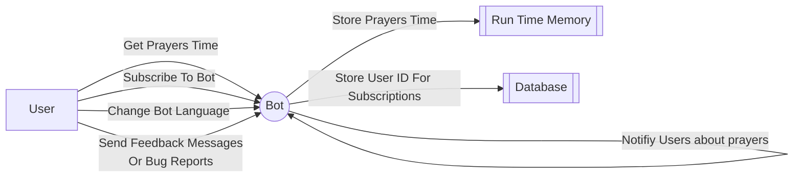

# gopray 🙏

A Telegram Bot to get muslim prayers time, And subscribe to get notified on the prayers time

  

## Contributing 🤼

Before we start talking about the bot, I would really appreciate if you can contribute to this project by adding more features or fixing bugs. It is totally open source and free to use. 😁

## Usecase 🛠️

## Subscription Feature 📢

This feature allows the bot to notify users `20 min` before the prayers time. (Time is set by the `UPCOMING_REMINDER` env variable)

Users can subscribe to the bot by sending `/subscribe` command to the bot. And unsubscribe by sending `/unsubscribe` command to the bot.

Also on friday the bot will remind the user to pray gomoaa prayer. at `7:00 PM` (Time is set by the `GOMOAA_REMINDER_HOUR` env variable), This is value to when to remind them, The prayer time is calculated based on the prayers time of the day and sent to the user.

### How it works 🤔

In order to implement this feature, We have to make to bot sleep until `20 min` before the prayer's time. And then send a notification to the subscribed users.

Also when the time of the prayer's arrive we should also notify them.

So for that I use simple `channels` to make the bot sleep until the time of the prayer's time.

The first sleep is until the `20 min` before the prayer's time. And the second sleep is until the prayer's time.

for more details check the [notifier code](https://github.com/escalopa/gopray/tree/main/telegram/internal/adapters/notifier/notifier.go).

## Bot Options 🤖

| Command | Description |
| --- | --- |
| /help | Get help message showing all possible commands |
| /prayers | Get prayers time |
| /prayersdate | Get prayers time by date |
| /subscribe | Subscribe to get notified on the prayers time |
| /unsubscribe | Unsubscribe to not get notified on the prayers time |
| /lang | Change the bot language (Default English) |
| /feedback | Send feedback to the bot owner |
| /bug | Report a bug to the bot owner |

## References 📚

- [Telegram API (Telego)](https://github.com/SakoDroid/telego)
- [Prayer Times Site](http://dumrt.ru/ru/help-info/prayertime/)

## Upcoming Features 🚀

### Version 1 Milestones 🏁
- [x] Support date format for prayersdate command with leading zeros and with delimiters (. / -)
- [x] Implement subscriptions & notifications
- [x] Update text messages to be more user friendly

### Version 2 Milestones 🏁
- [x] store prayers time in memory to reduce the number of requests to the database since the prayers time is not changing
- [x] make response endpoint for admin to respond to feedback & bug messages
- [x] remind about gomoaa prayer on friday

### Version 3 Milestones 🏁
- [ ] Add different languages support (AR, RU)
