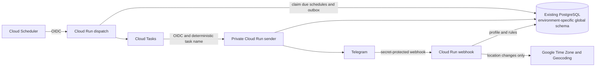

# Architecture and rollout

## Data ownership

The legacy `public.chats` and `public.prayers` tables remain untouched. Global testing data is owned by `global_bot_testing`, production data is owned by `global_bot_production`, foreign keys cascade from each schema's `chats` table, and `/delete_me` deletes the chat root.

Raw coordinates exist only in the webhook request while resolving the timezone and approximate place. Persistence rounds them to three decimals. The reverse-geocoded city is displayed in the immediate reply but is not stored; only Google's Place ID is retained. A future user-entered label can be stored because it is user-provided content.

## Calculation profile

Every persisted profile records coordinates, IANA timezone, calculation method, madhab, high-latitude rule, per-prayer adjustments, a regional Hijri-date correction, and a monotonically increasing version. Reminder tasks carry that version. A task becomes stale instead of sending if the location or calculation settings changed after it was queued.

The current calculation engine is `github.com/hablullah/go-prayer`, hidden behind `prayertime.Calculator`. That boundary lets us replace or compare engines without changing handlers, storage, or reminders.

Daily schedule headers use the calculated Umm al-Qura calendar from `github.com/hablullah/go-hijri`. The independently stored -2 to +2 day correction accounts for local moon-sighting differences and does not affect prayer-time calculations.

## Delivery behavior

The dispatcher selects only due rows from the partial due-time index using `FOR UPDATE SKIP LOCKED`. It writes a durable outbox record in the same transaction and uses a deterministic Cloud Task name. The sender leases a delivery key before calling Telegram and records the next occurrence after a successful send. Prayer reminders and opt-in weekly fasting/Al-Kahf reminders share this delivery path; all recurrence calculations use the profile's IANA timezone.

Outbox rows are removed after Cloud Tasks accepts them. A daily authenticated maintenance request deletes processed update keys after 7 days and terminal delivery records after 30 days, in bounded batches.

This prevents ordinary duplicate deliveries. A process crash after Telegram accepts a message but before PostgreSQL records it can still cause a retry because Telegram's Bot API has no idempotency parameter; delivery is therefore at-least-once in that narrow failure window.

## Rollout gates

1. Add the three new secrets to the GitHub `testing` environment.
2. Run the manual global deploy workflow for `testing`.
3. Compare a sample matrix covering Cairo, Makkah, Istanbul, Karachi, New York, London, Stockholm, and a southern-hemisphere city against trusted local authority timetables.
4. Verify private-chat location sharing, group-admin authorization, Hijri correction boundaries, all three reminder toggles and deliveries, secret-header rejection, reminder retries, and `/delete_me`.
5. Review Google API quotas/budget alerts and privacy wording.
6. Add the independent production values to the GitHub `production` environment and deploy it using the production bot token.
