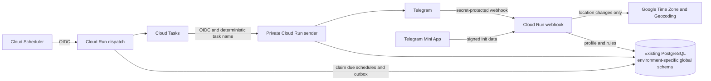

# Architecture and rollout

This document defines the global system boundary and major trust relationships.
For package ownership, state, detailed flows, and operations, use the
[engineering guide](README.md).

## Mini App

The webhook service embeds and serves a dependency-free HTML/CSS/JavaScript Mini App at `/app/`. Deployment sets that HTTPS URL as the bot's default chat menu button. The app calls same-origin `/api/miniapp/*` endpoints and uses the same storage, location resolver, prayer calculator, and reminder planner as the conversational interface, so settings remain consistent across both interfaces.

The backend never trusts a Telegram user ID sent in JSON. Every Mini App API request carries the exact `Telegram.WebApp.initData` string in a header. The server verifies Telegram's HMAC signature with the environment's bot token, rejects duplicate fields and sessions older than 24 hours, and derives the private chat ID from the signed user object. The app is private-chat scoped; group configuration remains in the bot, where administrator authorization is enforced.

The Qibla tool derives a great-circle bearing from the rounded coordinates already present in the profile and sends only the resulting bearing and distance to the browser. Supported Telegram clients can rotate the displayed needle with absolute device-orientation data; unsupported clients retain the numeric bearing and static compass.

Calendar export first creates a five-minute encrypted and authenticated download token from an authenticated Mini App request. The opaque token exposes neither the Telegram identity nor the bot token. The resulting same-origin URL generates a localized 7-day or 30-day iCalendar file on demand. Events are emitted as UTC instants for broad calendar-client compatibility, while the source timezone and calculation method remain in the calendar metadata. No exported event UID contains a Telegram user or chat ID.

## Data ownership

The legacy `public.chats` and `public.prayers` tables remain untouched. Global testing data is owned by `global_bot_testing`, production data is owned by `global_bot_production`, foreign keys cascade from each schema's `chats` table, and `/delete_me` deletes the chat root.

Raw coordinates exist only in the webhook request while resolving the timezone and approximate place. Persistence rounds them to three decimals. The reverse-geocoded city is displayed in the immediate reply but is not stored; only Google's Place ID is retained. A future user-entered label can be stored because it is user-provided content.

Feedback is not stored in PostgreSQL. When a user explicitly replies to the localized feedback prompt, Telegram copies that message or screenshot into the private owner chat together with the sender's name, username, Telegram ID, and selected bot language. The prompt discloses that identity sharing before submission.

## Calculation profile

Every persisted profile records coordinates, IANA timezone, calculation method, madhab, high-latitude rule, per-prayer adjustments, a regional Hijri-date correction, and a monotonically increasing version. Reminder tasks carry that version. A task becomes stale instead of sending if the location or calculation settings changed after it was queued.

The current calculation engine is `github.com/hablullah/go-prayer`, hidden behind `prayertime.Calculator`. That boundary lets us replace or compare engines without changing handlers, storage, or reminders.

Daily schedule headers use the calculated Umm al-Qura calendar from `github.com/hablullah/go-hijri`. The independently stored -2 to +2 day correction accounts for local moon-sighting differences and does not affect prayer-time calculations.

## Delivery behavior

The dispatcher selects only due rows from the partial due-time index using `FOR UPDATE SKIP LOCKED`. It writes a durable outbox record in the same transaction and uses a deterministic Cloud Task name. The sender leases a delivery key before calling Telegram and records the next occurrence after a successful send. Prayer reminders, configurable pre-prayer notices, and opt-in weekly fasting/Al-Kahf reminders share this delivery path; all recurrence calculations use the profile's IANA timezone.

The sender also maintains one active Telegram message slot per cleanup category. Before-prayer and at-prayer notifications share the `prayer` slot, so Asr's arrival replaces its pre-reminder, or the prior Dhuhr notification when no pre-reminder is enabled. Tomorrow, fasting, and Al-Kahf reminders have independent slots. Replaced messages are deleted immediately on a best-effort basis and through a durable Cloud Task fallback.

Telegram only permits message deletion for messages sent less than 48 hours ago. Every notification therefore receives a scheduled 36-hour cleanup task. This is especially important for weekly categories, whose next occurrence is too late to delete the previous Telegram message.

Outbox rows are removed after Cloud Tasks accepts them. A daily authenticated maintenance request deletes processed update keys after 7 days and terminal delivery records after 30 days, in bounded batches.

This prevents ordinary duplicate deliveries. A process crash after Telegram accepts a message but before PostgreSQL records it can still cause a retry because Telegram's Bot API has no idempotency parameter; delivery is therefore at-least-once in that narrow failure window.

The exact delivery state machine, cleanup categories, and required compensation
for post-send failures are documented in
[Reminder delivery](reminder-delivery.md).

## Rollout gates

1. Add the three new secrets to the GitHub `testing` environment.
2. Run the manual global deploy workflow for `testing`.
3. Compare a sample matrix covering Cairo, Makkah, Istanbul, Karachi, New York, London, Stockholm, and a southern-hemisphere city against trusted local authority timetables.
4. Verify private-chat location sharing, group-admin authorization, Hijri correction boundaries, all reminder toggles, pre-prayer lead times, category cleanup, secret-header rejection, reminder retries, and `/delete_me`.
5. Review Google API quotas/budget alerts and privacy wording.
6. Add the independent production values to the GitHub `production` environment and deploy it using the production bot token.
