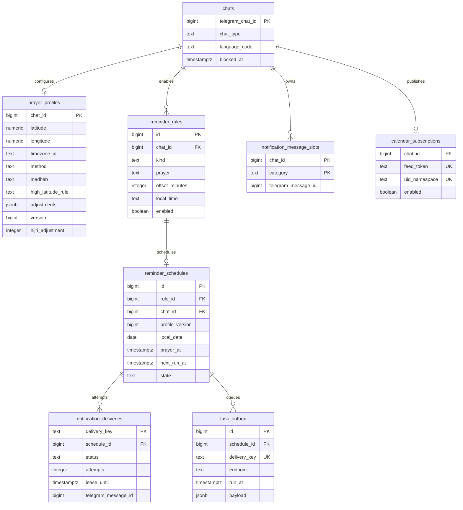

# Data model

Testing and production use the same PostgreSQL database but different schemas:

- `global_bot_testing`
- `global_bot_production`

Every SQL query passes through `internal/store`, which qualifies the logical
`global_bot` schema with the configured environment schema. The legacy `public`
tables are outside this boundary.

## Entity relationships

`processed_updates` is independent from this graph. Its primary key is the
Telegram `update_id`, and it stores only processing status, lease, attempts, and
an abbreviated error.

## Table responsibilities and invariants

### `chats`

The root of user-owned global-bot data. It stores chat type, saved language, and
whether Telegram has blocked delivery. Deleting a chat cascades to its profile,
rules, schedules, deliveries, outbox rows, and message slots.

### `prayer_profiles`

One row per configured chat. Coordinates are rounded to three decimals. The
profile version increases whenever a change can affect calculated times.
Queued tasks carry this version and become stale instead of sending after a
profile change.

### `reminder_rules`

Represents desired behavior, not a queued job. The unique key prevents duplicate
rules with the same chat, kind, prayer, and offset. Weekly reminders use their
own kinds and local times.

### `reminder_schedules`

Exactly one current occurrence per rule because `rule_id` is unique. The
schedule stores both the prayer instant and the notification run time. Its state
moves from `pending` to `queued`, then back to `pending` when the sender writes
the next occurrence.

### `task_outbox`

The transaction boundary between PostgreSQL and Cloud Tasks. A due schedule and
its send payload are committed together. Deletion tasks also use this table but
have no schedule ID. `delivery_key` is unique.

### `notification_deliveries`

The idempotency and retry lease for sender tasks. The deterministic delivery key
is based on schedule, run instant, and profile version. Terminal states are
`sent`, `failed`, and `stale`; `processing` has a two-minute lease.

### `notification_message_slots`

Stores the latest successfully committed Telegram message ID for each cleanup
category:

- `prayer`
- `tomorrow`
- `weekly_fasting`
- `weekly_kahf`

Before-prayer and at-prayer messages deliberately share `prayer`.

### `calendar_subscriptions`

Stores one optional rolling calendar feed per private chat. `feed_token` is a
random 256-bit bearer credential used by Google Calendar when it fetches the
feed. `uid_namespace` is a stable random value used in event UIDs so a prayer
keeps the same identity when its calculated time changes. Disabling the row
immediately rejects future feed fetches; reconnecting issues a new feed token
but keeps the UID namespace stable.

## Retention

| Data | Retention behavior |
| --- | --- |
| Completed or failed webhook update keys | Deleted after 7 days |
| Sent, failed, or stale notification deliveries | Deleted after 30 days |
| Telegram notification messages | Scheduled for deletion after 36 hours |
| Profiles and reminder configuration | Kept until `/delete_me` or chat deletion |
| Calendar subscription | Kept until `/delete_me`; its feed token can be disabled or replaced |
| Feedback content | Never stored in PostgreSQL |

Retention runs in bounded batches from the authenticated maintenance Scheduler
job.

## Migration rules

- Bootstrap the target schema before the first Goose migration.
- Always give Goose the environment-specific version table:
  `-table="${GLOBAL_DB_SCHEMA}.goose_db_version"`.
- Deploy migrations before application revisions that require them.
- Prefer forward corrective migrations in production.
- Never run global migrations against the legacy default migration table or
  `public` schema.
