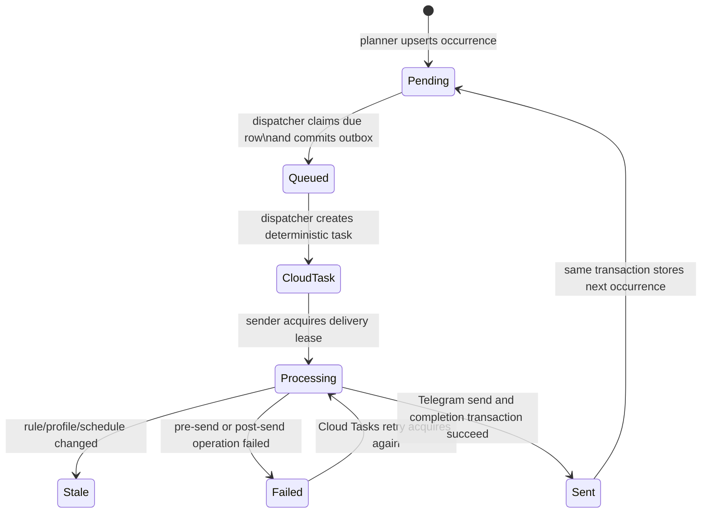
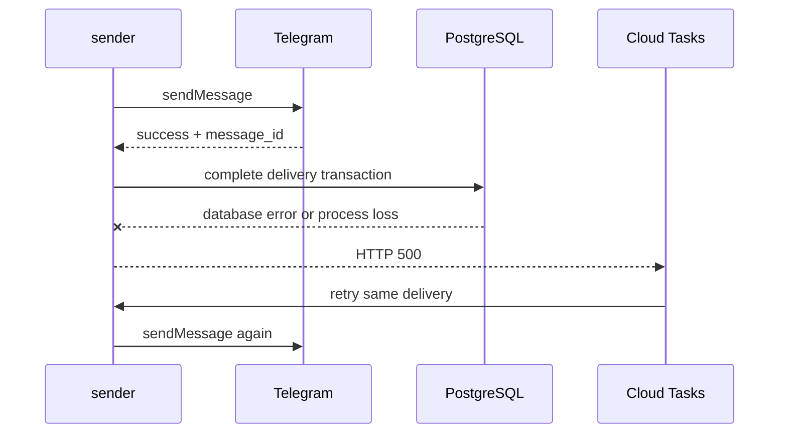

# Reminder delivery

This is the source of truth for reminder planning, dispatch, retries,
idempotency, and Telegram message cleanup.

## Components

| Component | Responsibility |
| --- | --- |
| Planner | Calculates the next occurrence in the profile's IANA timezone |
| PostgreSQL schedule | Stores one next occurrence for each enabled rule |
| Dispatcher | Claims due schedules and writes the outbox |
| Cloud Tasks | Delivers authenticated HTTP tasks with retry and backoff |
| Sender | Leases a delivery key, validates freshness, calls Telegram, and advances recurrence |
| Message slot | Identifies the last successfully committed Telegram message in a cleanup category |

## End-to-end state flow

The dispatcher uses `FOR UPDATE SKIP LOCKED`, so concurrent dispatcher
instances cannot claim the same pending row. The outbox insertion and
`pending → queued` transition share a transaction.

The Cloud Task name is a hash of the deterministic delivery key. Creating the
same task twice returns `AlreadyExists` and is treated as success.

## Sender algorithm

1. Load the referenced schedule.
2. Acquire the delivery key, or return success if another request owns it or it
   is already sent.
3. Load the profile, rule, and chat locale.
4. Reject the task as stale if rule state, schedule identity, run time, or
   profile version changed.
5. Send the localized message through Telegram.
6. Calculate the next occurrence.
7. In one PostgreSQL transaction:
   - mark the delivery `sent` and store the Telegram message ID;
   - advance the schedule to its next occurrence and return it to `pending`;
   - replace the category's message slot;
   - enqueue deletion of the prior slot message;
   - enqueue 36-hour expiry of the new message.
8. Attempt immediate best-effort deletion of the prior slot message.

## Cleanup categories

| Notification | Category | Replacement behavior |
| --- | --- | --- |
| Pre-prayer | `prayer` | Replaces the preceding prayer notification |
| Prayer time | `prayer` | Replaces its pre-reminder, or the preceding prayer |
| Tomorrow reminder | `tomorrow` | Replaces the prior tomorrow reminder |
| Monday/Thursday fasting | `weekly_fasting` | Replaces only the prior fasting reminder |
| Friday Al-Kahf | `weekly_kahf` | Replaces only the prior Al-Kahf reminder |

Every message also expires after 36 hours because Telegram cannot delete bot
messages once they are older than 48 hours.

## Delivery guarantee

The system prevents ordinary duplicate queueing and concurrent processing, but
the Telegram API call and PostgreSQL commit cannot be one atomic transaction.
The delivery guarantee is therefore **at least once** in this narrow sequence:

If completion fails, the first Telegram message ID was never committed to the
message slot. A retry cannot discover that copy, so normal replacement cleanup
cannot delete it.

Required safeguards for this boundary are:

1. Database connectivity must be compatible with the runtime connection pool.
   The Supabase transaction pooler must not be used with pgx's named
   prepared-statement cache; configure runtime connections with
   `pgx.QueryExecModeExec`.
2. If any operation after a successful `sendMessage` fails, the sender should
   make a compensating `deleteMessages` call for the just-sent message before
   returning a retryable error.
3. Tests must simulate “Telegram send succeeds, completion fails, task retries”
   and assert that only the retry's message remains.

Compensation greatly reduces visible duplicates but still depends on Telegram
accepting the delete request. Exactly-once delivery is not possible without an
idempotency facility on the external send API.

## Retry configuration

The notification queue currently uses:

- maximum 8 attempts;
- maximum retry duration of 1 hour;
- minimum backoff of 5 seconds;
- maximum backoff of 5 minutes;
- maximum 50 concurrent dispatches and 20 dispatches per second.

Changing these values affects incident amplification and delivery delay. Update
this document and the operational alerts whenever queue policy changes.
