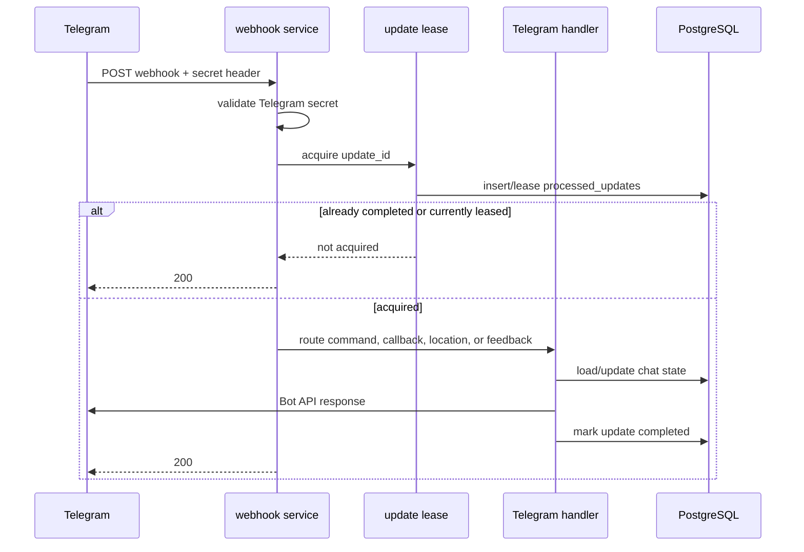
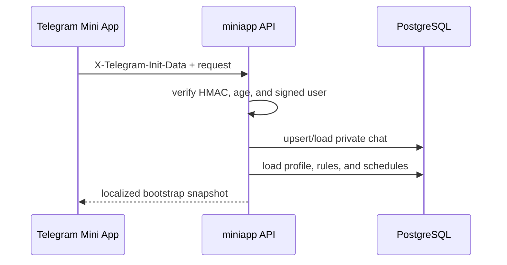

# Request flows

This document follows user-facing requests through authentication, business
logic, persistence, and external APIs.

## Telegram webhook update

The webhook header protects the endpoint. `update_id` leasing protects against
Telegram retrying the same update. Update records are retained for seven days.
Full Telegram update bodies are never persisted.

## Location onboarding or change

Location writes are the only normal user flow that calls Google APIs.

1. Telegram supplies latitude and longitude from a location message or the Mini
   App location manager.
2. The handler validates coordinate bounds.
3. `internal/location` resolves an IANA timezone and approximate place with the
   Google Time Zone and Geocoding APIs.
4. Persistence rounds coordinates to three decimal places and stores the
   timezone and Google Place ID. The formatted Google address is not stored.
5. The profile version increases.
6. The reminder planner rebuilds schedules using the new version and timezone.
7. The response calculates schedules locally with the saved rounded profile.

If Google is unavailable, existing profiles, schedules, commands, reminders,
Qibla direction, and calendar subscriptions continue working. Only location writes
fail.

## Mini App session and API

The backend never accepts a Telegram user ID from the JSON body. It derives the
identity only from signed `initData`, rejects duplicate signed fields, and
rejects sessions older than 24 hours.

Settings and reminder controls are edited in the browser but persisted as one
snapshot only after the user presses **Save changes**. A successful response is
a new complete bootstrap snapshot, allowing the UI to re-render immediately in
the newly selected language.

### Cached startup and offline behavior

On a returning launch, the Mini App reads a device-local snapshot scoped to the
Telegram user and renders it immediately while requesting a fresh bootstrap.
Snapshots older than 48 hours or missing a complete today/tomorrow schedule are
discarded. If refresh succeeds, the live response replaces the cache. If it
fails temporarily, the cached schedule remains visible with an offline banner,
but all server-side mutations stay disabled. An expired or invalid signed
Telegram session still fails closed with the normal reopen-from-Telegram state;
the cache never bypasses server authentication.

The selected day's schedule can be rendered into a localized portrait PNG and
sent to the platform share sheet without an API request. Some Telegram Android
WebViews ignore browser download links, so an unavailable or rejected file
share falls back to an authenticated multipart upload. The webhook validates a
PNG of the expected 1080×1350 dimensions and immediately sends it to the user's
private bot chat. The bot does not retain the image.

## Prayer schedule display

Both the conversational bot and Mini App use the same profile and
`prayertime.Calculator`:

1. Load the saved profile and locale.
2. Calculate the requested local day.
3. Apply the selected method, madhab, high-latitude rule, and minute
   adjustments.
4. Format Gregorian and corrected Hijri dates.
5. Localize prayer names and explanatory labels.

The Hijri correction changes the displayed Hijri date and which Gregorian date
matches an Islamic occasion. It never changes prayer instants.

## Islamic occasions

`internal/occasions` is the single catalog used by the Mini App, calendar, and
reminder planner. Each definition contains a Hijri month/day, category, emoji,
and optional HTTPS Quran/Hadith references; localized explanatory and
recommended-action text lives in `internal/i18n`.

The Mini App returns the next three occurrences after applying the profile's
Hijri correction. The calendar adds matching all-day events within its rolling
30-day window. Users can independently opt into major, fasting, and commonly
observed reminder groups in either interface. The planner sends the next
matching reminder at 20:00 on the preceding local evening. Commonly observed
dates remain clearly labelled because exact dates, evidence, or community
practice may differ.

## Qibla and calendar tools

Qibla direction is calculated from the saved rounded coordinates. The server
returns only bearing and distance to the Mini App. On supported clients,
Telegram's absolute device-orientation API rotates the needle; otherwise the
numeric bearing remains available.

Calendar connection separates authenticated management from anonymous feed
fetching:

1. An authenticated Mini App request creates or reuses a random private feed
   token and stable UID namespace.
2. The Mini App opens Google Calendar with the HTTPS feed URL. A copy-link
   button supports Google's desktop **Other calendars → From URL** flow.
3. Google fetches the `.ics` URL without Telegram authentication.
4. The server validates the random token, loads the current profile, and
   calculates today plus the following 29 local days.
5. Stable event UIDs let Google update changed prayer times without creating a
   second copy of the same prayer and date.
6. Disconnecting the calendar disables the token. Future feed requests return
   HTTP 401.

The feed contains timed prayer events and corrected all-day Islamic occasion
events. It always rolls forward when fetched and includes refresh hints, but
Google decides when it refreshes subscribed calendars. The URL is a bearer
credential and must remain private. It and the event UIDs expose neither the
Telegram user ID nor bot token.

## Feedback

Feedback is accepted only after an explicit localized prompt. Private text,
media, or screenshots are copied to the configured owner's private bot chat
with a disclosed sender identity and a **Contact user** button. PostgreSQL does
not store feedback content. A normal reply in the owner's bot chat is not
forwarded automatically.
