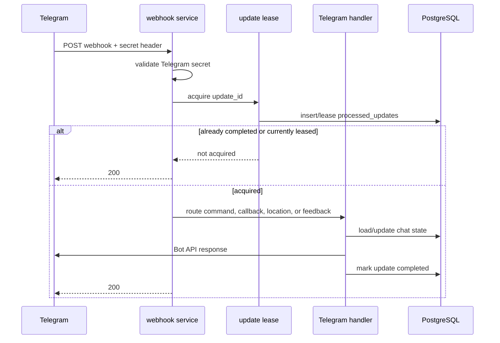
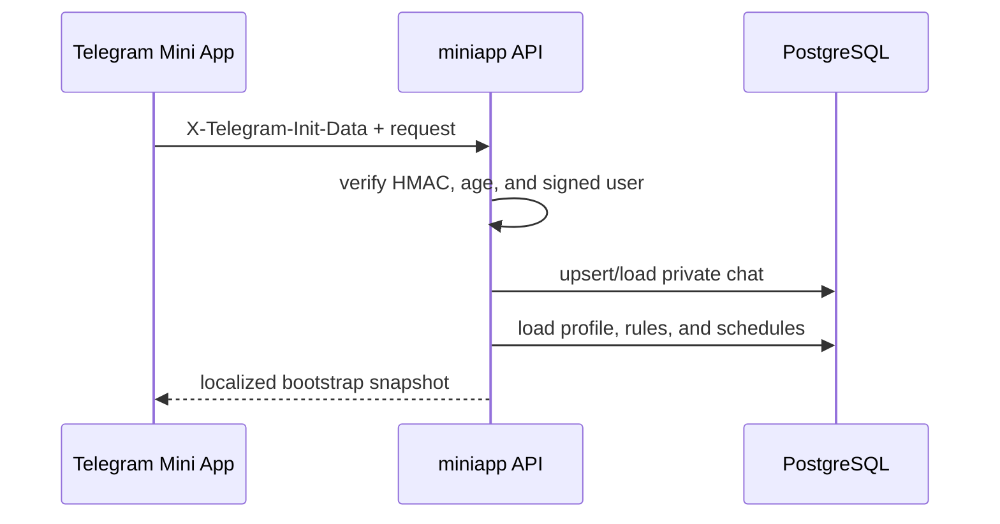

# Request flows

This document follows user-facing requests through authentication, business
logic, persistence, and external APIs.

## Telegram webhook update

The webhook header protects the endpoint. `update_id` leasing protects against
Telegram retrying the same update. Update records are retained for seven days.
Full Telegram update bodies are never persisted.

## Location onboarding or change

Location writes are the only normal user flow that calls Google APIs.

1. Telegram supplies latitude and longitude from a location message or the Mini
   App location manager.
2. The handler validates coordinate bounds.
3. `internal/location` resolves an IANA timezone and approximate place with the
   Google Time Zone and Geocoding APIs.
4. Persistence rounds coordinates to three decimal places and stores the
   timezone and Google Place ID. The formatted Google address is not stored.
5. The profile version increases.
6. The reminder planner rebuilds schedules using the new version and timezone.
7. The response calculates schedules locally with the saved rounded profile.

If Google is unavailable, existing profiles, schedules, commands, reminders,
Qibla direction, and calendar exports continue working. Only location writes
fail.

## Mini App session and API

The backend never accepts a Telegram user ID from the JSON body. It derives the
identity only from signed `initData`, rejects duplicate signed fields, and
rejects sessions older than 24 hours.

Settings and reminder controls are edited in the browser but persisted as one
snapshot only after the user presses **Save changes**. A successful response is
a new complete bootstrap snapshot, allowing the UI to re-render immediately in
the newly selected language.

## Prayer schedule display

Both the conversational bot and Mini App use the same profile and
`prayertime.Calculator`:

1. Load the saved profile and locale.
2. Calculate the requested local day.
3. Apply the selected method, madhab, high-latitude rule, and minute
   adjustments.
4. Format Gregorian and corrected Hijri dates.
5. Localize prayer names and explanatory labels.

The Hijri correction changes only the displayed Hijri date. It never changes
the Gregorian date or prayer instants.

## Qibla and calendar tools

Qibla direction is calculated from the saved rounded coordinates. The server
returns only bearing and distance to the Mini App. On supported clients,
Telegram's absolute device-orientation API rotates the needle; otherwise the
numeric bearing remains available.

Calendar export has two requests:

1. An authenticated Mini App request asks for 7 or 30 days.
2. The backend returns a same-origin URL containing a five-minute encrypted and
   authenticated token.
3. Telegram's native downloader, or an anchor fallback, downloads the `.ics`
   file.
4. The server loads the current profile, calculates each day on demand, and
   emits localized events as UTC instants.

The URL and event UIDs expose neither the Telegram user ID nor bot token.

## Feedback

Feedback is accepted only after an explicit localized prompt. Private text,
media, or screenshots are copied to the configured owner's private bot chat
with a disclosed sender identity and a **Contact user** button. PostgreSQL does
not store feedback content. A normal reply in the owner's bot chat is not
forwarded automatically.
