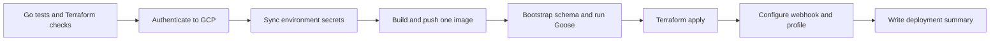

# Runtime and deployment

## Environment isolation

Testing and production reuse the organization's existing GCP project setup and
Supabase PostgreSQL database, but their global-bot state is isolated. The
GitHub environments may point at the same GCP project or separate existing GCP
projects; the isolation rules below apply in both cases.

| Resource | Testing | Production |
| --- | --- | --- |
| Resource prefix | `global-prayer-test` | `global-prayer-prod` |
| PostgreSQL schema | `global_bot_testing` | `global_bot_production` |
| Terraform state prefix | `prayer-bot/global-testing` | `prayer-bot/global-production` |
| GitHub environment | `dev` | `prod` |
| Telegram token and webhook secret | Testing values | Production values |
| Cloud Run services, queue, Scheduler jobs, service accounts | Separate | Separate |

Neither environment reads or writes the legacy city-bot tables or runtime
configuration.

## Runtime topology

| Resource | Ingress | Identity |
| --- | --- | --- |
| `global-prayer-*-webhook` | Public | Telegram secret header or signed Mini App init data |
| `global-prayer-*-dispatch` | Cloud Scheduler only | Scheduler OIDC service account |
| `global-prayer-*-sender` | Cloud Tasks only | Task-caller OIDC service account |
| `global-prayer-*-notifications` | GCP API | Dispatcher service account can enqueue |

All services scale to zero. A first request can therefore include Cloud Run cold
start latency. No minimum instances are configured intentionally to control
cost.

The Google Calendar integration is a private `.ics` subscription served by the
webhook service. It adds no Google OAuth client, Calendar API credential,
Scheduler job, or separate runtime. Google fetches the URL on its own schedule;
each request calculates the current rolling 30-day window from the user's saved
profile.

## Secrets

Runtime services read environment-specific Secret Manager values:

- Telegram bot token;
- Telegram webhook secret;
- owner Telegram ID;
- Supabase runtime database URL;
- Terraform-managed Google Maps API key.

Only the webhook receives the webhook secret, owner ID, and Maps key. The
webhook and sender receive the bot token because both call Telegram; dispatch
does not. IAM grants secret access per service account rather than project-wide
runtime access.

Do not print secret values in workflow summaries, application logs, commands,
or documentation.

## Database connections

The deployment uses two connection types:

| Connection | Consumer | Reason |
| --- | --- | --- |
| `SUPABASE_DB_DIRECT_URL` | Bootstrap and Goose migrations | Schema creation and DDL require a direct session |
| `SUPABASE_DB_URL` | Cloud Run services through Secret Manager | Runtime connection pooling for scale-to-zero instances |

When `SUPABASE_DB_URL` uses the transaction pooler, pgx runtime connections must
disable the named prepared-statement cache by selecting
`pgx.QueryExecModeExec`. Symptoms of an incompatible configuration include
`SQLSTATE 42P05 prepared statement already exists` and
`SQLSTATE 26000 prepared statement does not exist`.

In this execution mode, JSONB parameters must be passed as JSON text rather than
Go `[]byte`. pgx otherwise encodes the byte slice as PostgreSQL `bytea` before
the target JSONB type is resolved, causing `SQLSTATE 22P02 invalid input syntax
for type json`. All profile adjustments and outbox payloads use the shared
JSON-text encoder in `internal/store`.

## Deployment workflow

The **Deploy global prayer bot** workflow is manual and accepts `testing` or
`production`.

Terraform creates or updates cloud resources; it does not create Telegram bot
tokens. The profile step reads current Telegram values and mutates only changed
fields. Telegram profile rate limits are reported as a successful skipped step
so infrastructure deployment is not rolled back by a cosmetic operation.

## Change safety

- Application-only changes create a new image and Cloud Run revisions.
- Schema changes must be backward compatible with the previously running
  revision because migrations run before Terraform applies the new image.
- Terraform resource renames can destroy and recreate resources; inspect the
  plan before applying them.
- Testing and production state prefixes must never be interchanged.
- A testing deployment must never use the production Telegram token.
- Legacy workflows and resources are separate and must not be included in a
  global-bot Terraform plan.

## Post-deployment checks

1. Confirm the workflow summary shows successful tests, migration, Terraform,
   and webhook configuration.
2. Check `GET /healthz` for all three services.
3. Run `/start`, `/today`, and one settings save in the selected bot.
4. Open the Mini App from Telegram and verify bootstrap, location state, and
   today/tomorrow switching.
5. Inspect Cloud Run 5xx and Cloud Tasks retries for at least one dispatch
   interval.
6. For reminder changes, test a pre-reminder, arrival notification, replacement
   deletion, and a forced retry in testing.
